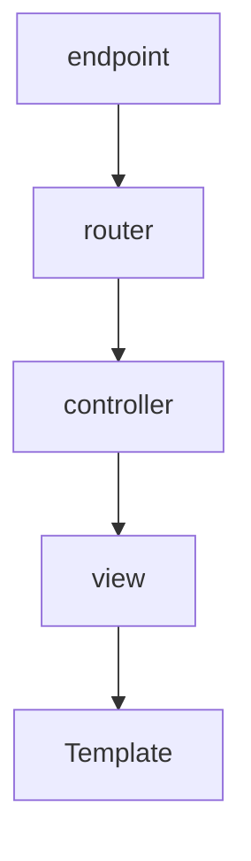

# Phoenix Misc Stuff

# Phoenix
## There are 6 primary type of things that make up a context
- Templates - html files
- Views - include view helpers etc+ here
- Controllers - stitch things together
- Contexts - most business logic
- Schemas - changesets
- Migrations - self explanatory

## Data Flow



## Plug
- There are 2 types of plugs, module plugs and function plugs. Module plugs need 2 functions (`init/1` and `call/2`)
- You can use plug modules and functions anywhere. Including endpoint, router, controllers
- The most important concept about plug is that it takes a connection, transforms the connection and returns the connection
- Before the start of any plug, it will check if it's halted. You can call `halted()` to stop any downstream plug. 
- A controller is essentially a plug
- You can override the controller actions by redefining the `Controller.action/2` function. Before specific controller actions are called, `Controller.action/2` is called. This is useful if you want to modify `assigns` in connection. E.g. adding `current_user` as a function argument to subsequent controller actions.

## Convenience `xxx_web.ex`
- Think of xxx_web.ex as a place to do all your import, use and aliasing.
- It's useful to do it here if all controllers, views, routers, channels need functions from specific modules
- It's important to not implement business logic in this file but just use it to import

## Creating new scopes in router
- This is useful when you know all routes with a certain pattern needs to go through some other forms of logic
- e.g. `/admin` might require an admin role. So you create a new scope and run additional pipeline (a group of plugs) or an additional single plug through `pipe_through`

## URL Helpers
```
alias RumblWeb.Router.Helpers, ​as:​ Routes
Routes.watch_path(%URI{}, ​:show​, video)

url = URI.parse(​"​​http://example.com/prefix"​)
Routes.watch_url(%URI{}, ​:show​, video)
```
- Instead of typical conn passed to generate routes, it's also possible to pass URI
- This is useful for generating links outside of the context of a web request or connection

```
url = RumblWeb.Endpoint.struct_url()
Routes.watch_url(%URI{}, ​:show​, video)
```
- This can also be done and settings in config will be loaded


